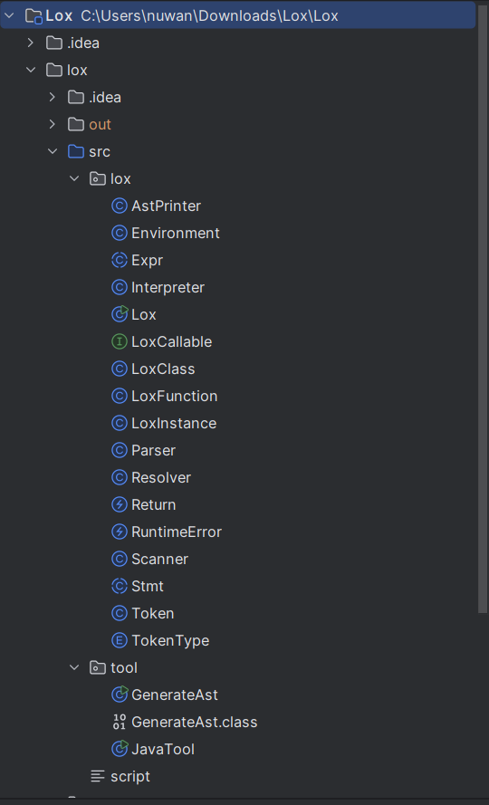
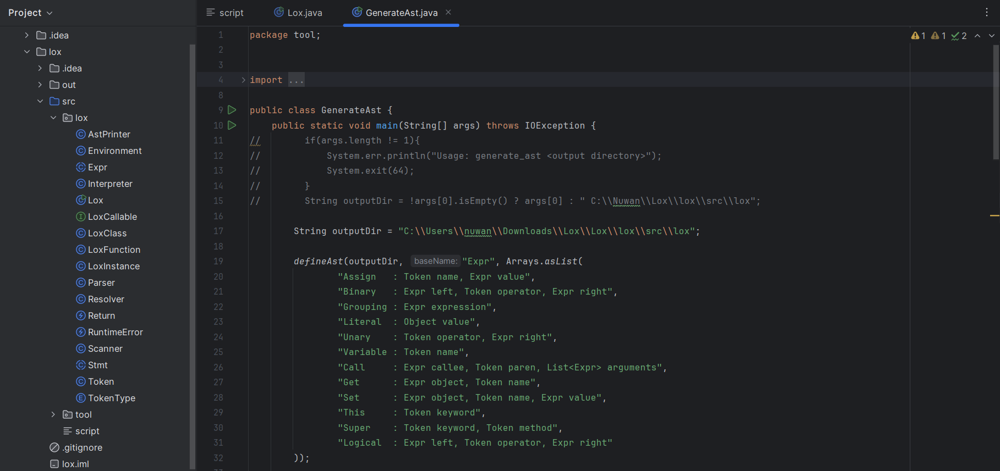
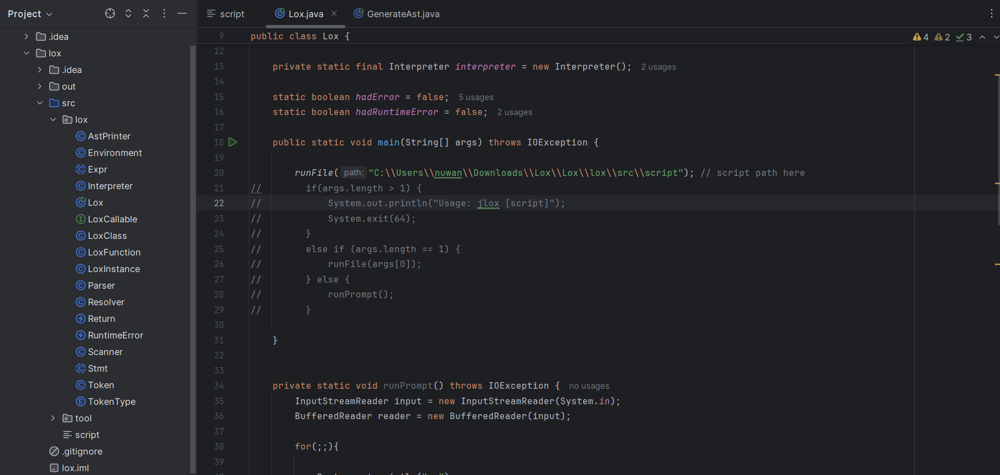
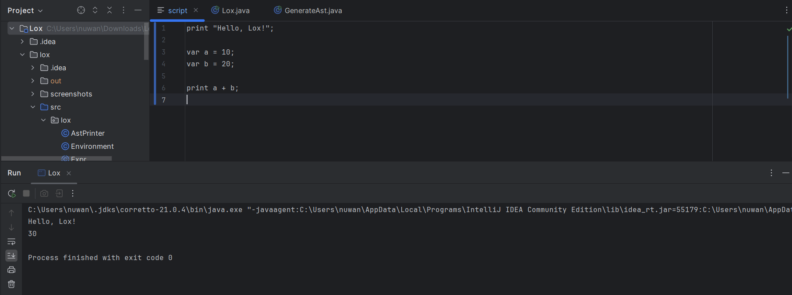

# 📘 Lox Interpreter (jlox – Java)

A Java implementation of the **Lox programming language**, based on
📘 *Crafting Interpreters* by **Robert Nystrom**.

This project demonstrates how to build an interpreter from scratch using Java, including scanning, parsing, AST generation, resolving, and interpretation.

---

## 📸 Screenshots

### Project Structure



### 1️⃣ Set GenerateAst Path and Generate AST

Before running the interpreter, you **must generate the AST classes**.

#### 🔹 Configure Output Path

Open `GenerateAst.java` and set the output directory:

```java
String outputDir = "C:\\Users\\<your-username>\\Downloads\\Lox\\Lox\\lox\\src\\lox";
```




### 2️⃣ Set Script Path, Write Code, and Run Interpreter

#### 🔹 Configure Output Path

Open `Lox.java` and update the script file path:

```java
runFile("C:\\Users\\<your-username>\\Downloads\\Lox\\Lox\\lox\\src\\script");
```





# 📖 More Lox Syntax

## 📄 For  **detailed and complete Lox syntax** , please refer to Lox Syntax.doc
